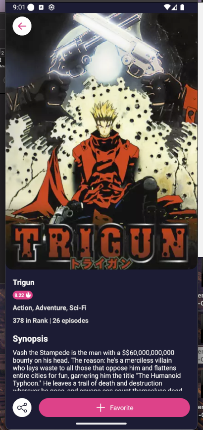

# Welcome to your Expo app 👋

This is an [Expo](https://expo.dev) project created with [`create-expo-app`](https://www.npmjs.com/package/create-expo-app).

## Requirements

- Node version >= 20.18.1

## Get started

1. Install dependencies

   ```bash
   yarn install
   ```

2. Start the app

   ```bash
   yarn android
   ```

In the output, you'll find options to open the app in a

- [development build](https://docs.expo.dev/develop/development-builds/introduction/)
- [Android emulator](https://docs.expo.dev/workflow/android-studio-emulator/)
- [iOS simulator](https://docs.expo.dev/workflow/ios-simulator/)
- [Expo Go](https://expo.dev/go), a limited sandbox for trying out app development with Expo

You can start developing by editing the files inside the **app** directory. This project uses [file-based routing](https://docs.expo.dev/router/introduction).

## Technical Notes

- integration test should be / better be done using testID, i used text to make development faster
-

## Screen Record

## Screen Record

| Screen Name  | Link                                                           |
| ------------ | -------------------------------------------------------------- |
| Record       | <video src=".github/images/record.mp4"  controls width="300"/> |
| gener filter | <video src=".github/images/filter.mp4" controls width="300" /> |
| details      |                           |
